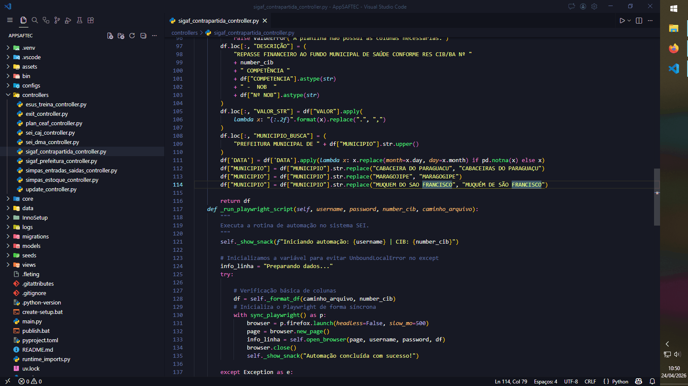

# 💊 Automações da SAFTEC

Aplicação robusta para automação de tarefas e gestão de dados, construída com um micro framework MVC sob medida.
[[]]
## 📝 Descrição

O **AppSAFTEC** é uma ferramenta desenvolvida para otimizar processos e aumentar a produtividade. Utilizando o poder do **Flet** para a interface, **Playwright** para automações web complexas e o ecossistema **Python**, o projeto segue o padrão de arquitetura **MVC (Model-View-Controller)** para garantir escalabilidade e fácil manutenção.

## 🚀 Tecnologias e Ferramentas

- **Linguagem:** Python
- **Interface:** [Flet](https://flet.dev/) (Flutter for Python)
- **Automação Web:** [Playwright](https://playwright.dev/python/)
- **Gerenciador de Pacotes:** [uv](https://github.com/astral-sh/uv) (Extremamente rápido)
- **Framework de Estrutura:** [fleting](https://github.com/fleting-py/fleting)

## ⚙️ Funcionalidades

- **Arquitetura MVC:** Separação clara de responsabilidades (Interface, Lógica e Dados).
- **Interface Moderna:** UI intuitiva e responsiva para desktop e web.
- **Automação Avançada:** Execução de tarefas repetitivas via browser com Playwright.
- **Gestão de Dados:** Integração para controle e monitoramento de ações.

## 🔧 Instalação e Configuração

Certifique-se de ter o `uv` instalado em sua máquina. Caso não tenha, instale via:
`pip install uv`

1. **Clone o repositório:**
   ```bash
   git clone [url-do-seu-repositorio]
   cd AppSAFTEC
   ```

2. **Inicialize o Banco de Dados:**
   Prepare o ambiente e as tabelas necessárias:
   ```bash
   uv run fleting db init
   uv run fleting db migrate
   ```

## 💻 Como Usar

Para rodar a aplicação utilizando o gerenciador `uv` e o framework `fleting`, execute o comando abaixo:

```bash
uv run fleting run
```

## 📌 Observações

- **Personalização:** Sinta-se à vontade para adicionar novos módulos de automação na camada de Controller.
- **Evolução:** O projeto é modular, permitindo a fácil integração de novas APIs e fontes de dados conforme a demanda da SAFTEC evolui.

---

**Desenvolvido por:** Bernardo Nogueira – SAFTEC/DASF

---
